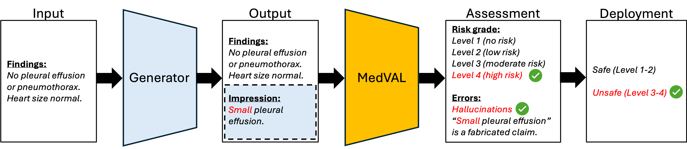

# MedVAL: Medical Text Validator

[](https://arxiv.org/abs/2507.03152)          [](https://huggingface.co/stanfordmimi/MedVAL-4B)          [](https://huggingface.co/datasets/stanfordmimi/MedVAL-Bench/)          [](LICENSE)



**Figure 1** | **MedVAL test-time workflow**. A generator LM produces an output, and MedVAL assesses the output's factual consistency with the input, while assigning a risk grade and determining its safety for deployment.

## 🏥 What is MedVAL?

MedVAL is a self-supervised framework for expert-level validation of AI-generated medical text using language models. The system is designed to evaluate the accuracy and safety of AI-generated medical text across multiple medical tasks. The framework supports both model fine-tuning and evaluation.

## ⚡️ Installation

### Environment Setup

Create and activate the conda environment:

```bash
conda env create -f env.yml
conda activate medval
```

## 🚀 Evaluation Instructions

```bash
python run.py --config=test
```

### 1. API-based Models

For evaluating API-based models (OpenAI, Anthropic, Gemini, etc.):

**Configuration (`configs/test.yaml`)**:
```yaml
tasks: [dialogue2note, medication2answer, query2question, report2impression]
data: test
method: zero-shot # [zero-shot, finetune]

n_samples: null
debug: False

model: openai/gpt-4o-mini
api_base: null
api_key: ${API_KEY}
local_model_path: null
```

### 2. Local/Huggingface Models

For evaluating local or HuggingFace models:

**Configuration (`configs/test.yaml`)**:
```yaml
tasks: [dialogue2note, medication2answer, query2question, report2impression]
data: test
method: zero-shot # [zero-shot, finetune]

n_samples: null
debug: False

model: local/MODEL_NAME
api_base: null
api_key: null
local_model_path: /path/to/local/model
```

## 🔥 Fine-Tuning Instructions

```bash
python run.py --config=train
```

### 1. API-based Teacher Models

For fine-tuning a local student model using an API-based teacher model:

**Configuration (`configs/train.yaml`)**:
```yaml
tasks: [report2simplified, query2question, report2impression, report2simplified]
data: train
method: finetune

n_samples: null
debug: False
num_threads: 16
num_epochs: 5
threshold: 0.95

model: openai/gpt-4o-mini
api_base: null
api_key: ${API_KEY}

student_model: local/STUDENT_MODEL_NAME
local_model_path: /path/to/student/model
```

### 2. Local/Huggingface Models

For fine-tuning a local student model using a local teacher model:

**Configuration (`configs/train.yaml`)**:
```yaml
tasks: [report2simplified, query2question, report2impression, report2simplified]
data: train
method: finetune

n_samples: null
debug: False
num_threads: 16
num_epochs: 5
threshold: 0.95

model: local/TEACHER_MODEL_NAME
api_base: null
api_key: null

student_model: local/STUDENT_MODEL_NAME
local_model_path: /path/to/student/model
```

## 🔧 API Model Configurations

### OpenAI
```yaml
model: openai/MODEL_NAME
api_base: null
api_key: ${OPENAI_API_KEY}
```

### Gemini
```yaml
model: gemini/MODEL_NAME
api_base: null
api_key: ${GEMINI_API_KEY}
```

### Anthropic
```yaml
model: anthropic/MODEL_NAME
api_base: null
api_key: ${ANTHROPIC_API_KEY}
```

### SGLang
```yaml
model: openai/HUGGINGFACE_MODEL_NAME
api_base: http://SERVER_IP:PORT/v1
api_key: local
```

### Ollama
```yaml
model: ollama_chat/MODEL_NAME
api_base: http://SERVER_IP:PORT
api_key: null
```

## 📊 Dataset

MedVAL uses the MedVAL-Bench dataset, automatically loaded from HuggingFace:

```python
from datasets import load_dataset
dataset = load_dataset("stanfordmimi/MedVAL-Bench")
```

The dataset includes training and test splits for diverse medical tasks.

## 📊 Model

The MedVAL-4B model can be downloaded from HuggingFace: ```stanfordmimi/MedVAL-4B```.

Once downloaded, run evaluation using this model by setting local_model_path ```/path/to/medval-4b```.

## 🎯 Configuration Parameters

### Core Parameters
- `tasks`: List of tasks for training/evaluation
- `data`: Dataset split (`train` or `test`)
- `method`: Evaluation method (`zero-shot` or `finetune`)
- `n_samples`: Number of samples to process (null for all)
- `debug`: Enable debug mode for detailed output

### Model Parameters
- `model`: Model identifier (API or local)
- `api_base`: API endpoint URL
- `api_key`: API key (use `${ENV_VAR}` for environment variables)
- `local_model_path`: Path to local model files

### Fine-tuning Parameters
- `student_model`: Student model for fine-tuning
- `num_threads`: Number of threads for training
- `num_epochs`: Training epochs
- `threshold`: Filtering threshold

## 📈 Results

Results are automatically saved to the `results/` directory with the following structure:
```
results/
├── zero-shot/
│   └── model_name.csv
└── finetune/
    └── model_name.csv
```

## 🏗️ Project Structure

```
MedVAL/
├── configs/          # Configuration files
├── medval/           # Core package
│   ├── pipeline.py   # Main MedVAL pipeline
│   ├── generator.py  # Text generation module
│   └── validator.py  # Validation module
├── utils/            # Utility functions and prompts
├── agents/           # Fine-tuned model storage
├── results/          # Evaluation results
└── run.py            # Main execution script
```

## 📎 Citation

If you find this repository useful for your work, please cite the following paper:

```bibtex
@article{aali2025expert,
  title={Expert-level validation of AI-generated medical text with scalable language models},
  author={Asad Aali and Vasiliki Bikia and Maya Varma and Nicole Chiou and Sophie Ostmeier and Arnav Singhvi and Magdalini Paschali and Ashwin Kumar and Andrew Johnston and Karimar Amador-Martinez and Eduardo Juan Perez Guerrero and Paola Naovi Cruz Rivera and Sergios Gatidis and Christian Bluethgen and Eduardo Pontes Reis and Eddy D. Zandee van Rilland and Poonam Laxmappa Hosamani and Kevin R Keet and Minjoung Go and Evelyn Ling and David B. Larson and Curtis Langlotz and Roxana Daneshjou and Jason Hom and Sanmi Koyejo and Emily Alsentzer and Akshay S. Chaudhari},
  journal={arXiv preprint arXiv:2507.03152},
  year={2025}
}
```

## 📄 License

This project is licensed under the terms specified in the [LICENSE](LICENSE) file.

## 🤝 Contributing

We welcome contributions to improve MedVAL! Please feel free to submit issues, feature requests, or pull requests.

## 🙏 Acknowledgments

This repository is built using [DSPy](https://github.com/stanfordnlp/dspy) for language model fine-tuning.
